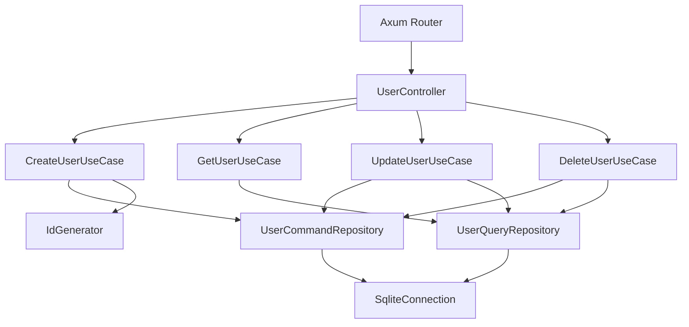

# 🦀 True Rusted Clean Architecture (真のRusted CA)

## 🎯 設計哲学

**「Rustの特性を活かし、CAの美しさを最大化する」**

- ✅ **Lightning Clean Commerce の成功パターン**を基盤とする
- ✅ **In-Memory CQRS**でCAの美しさに集中
- ✅ **層別Result型**でエラー発生源を明確化
- ✅ **ジェネリック制約**による型安全性の徹底
- ✅ **Value Objects**によるドメインルール実装

---

## ✅ 2025/7/10時点の実装状況

- **CQRS + Clean Architecture**をRustで実装
- **In-Memory SQLite**による永続化
- **DI（依存性注入）**はDIコンテナで一元管理
- **全CRUD（Create, Read, Update, Delete）API**が動作
- **全エンドポイントはcurlテストで正常動作確認済み（2025/7/10）**

---

## 🏗️ アーキテクチャ全体図

```
┌─────────────────────────────────────────────────────────────────┐
│                    Presentation Layer                           │
│  HTTP Request → Controller → PresentationResult<Response>       │
│  PresentationError (400, 401, 403, 404, 500)                  │
├─────────────────────────────────────────────────────────────────┤
│                   Application Layer                             │
│  Command/Query → UseCase → ApplicationResult<DTO>              │
│  ApplicationError (UserNotFound, EmailExists, Validation...)   │
├─────────────────────────────────────────────────────────────────┤
│                     Domain Layer                                │
│  Value Objects → Entity → DomainResult<Entity>                 │
│  DomainError (InvalidEmail, BusinessRuleViolation...)          │
├─────────────────────────────────────────────────────────────────┤
│                Infrastructure Layer                             │
│  In-Memory CQRS → Repository → InfrastructureResult<Data>      │
│  InfrastructureError (Database, Network, ExternalService...)   │
└─────────────────────────────────────────────────────────────────┘
```

---

## 🔄 CQRS Data Flow

### Command Side (Write)
```
HTTP Request → CreateUserRequest → CreateUserCommand 
    ↓
UseCase<T: CommandRepository, U: IdGenerator> 
    ↓
User Entity (Value Objects) → CommandRepository 
    ↓
In-Memory Normalized Store → UserResponse
```

### Query Side (Read)
```
HTTP Request → GetUserQuery 
    ↓
UseCase<T: QueryRepository> 
    ↓
QueryRepository → In-Memory Denormalized Store 
    ↓
UserResponseDto → HTTP Response
```

---

## 🚀 実装済みAPIエンドポイント

| メソッド | パス                  | 概要             |
|----------|----------------------|------------------|
| POST     | /api/users           | ユーザー作成     |
| GET      | /api/users/{id}      | ユーザー取得     |
| PUT      | /api/users/{id}      | ユーザー更新     |
| DELETE   | /api/users/{id}      | ユーザー削除     |

---

## 🔐 認証方式・認証タイミング

### 認証の仕組み

- 本APIは**JWT（JSON Web Token）による認証**を採用しています。
- 認証は`src/shared/middleware/auth_middleware.rs`で実装されており、**Axumのextractor型（AuthenticatedUserなど）**として各エンドポイントで利用されます。
- JWTの発行は`/api/auth/login`で行い、**.envの`AUTH_USER`/`AUTH_PASS`と一致した場合のみトークンが発行**されます。
- 各APIリクエスト時、`Authorization: Bearer <JWT_TOKEN>`ヘッダーを付与することで認証が行われます。

#### 認証の流れ

1. **ログイン**:  
   `/api/auth/login`に`{ "username": "...", "password": "..." }`でPOST  
   → 成功時に`access_token`と`refresh_token`が返る

2. **認証付きAPI呼び出し**:  
   `Authorization: Bearer <access_token>`を付与して各APIを呼び出す  
   → トークンの有効性・有効期限・ロール（role）をextractorで自動判定

3. **認証失敗時**:  
   401/403エラー（`INVALID_TOKEN`や`INSUFFICIENT_PERMISSIONS`等）が返る

#### 実装ファイル・認証タイミング

- **JWT認証ロジック**:  
  `src/shared/middleware/auth_middleware.rs`  
  - `AuthenticatedUser`型: 通常認証
  - `AdminUser`型: 管理者認証
  - `SuperAdminUser`型: スーパ管理者認証
  - `OptionalAuth`型: 任意認証

- **認証タイミング**:  
  - 各ルーター（例: `src/presentation/router/user_router.rs`）でextractor型をシグネチャに指定  
  - コントローラの引数で`auth: AuthenticatedUser`等を受け取ることで**リクエスト毎に自動認証**

---

## 🚩 認証が必要なエンドポイント一覧

| メソッド | パス                | 認証要否         | 備考                       |
|----------|--------------------|------------------|----------------------------|
| POST     | /api/users         | 必須（JWT）      | ユーザー作成               |
| GET      | /api/users/{id}    | 必須（JWT）      | ユーザー取得               |
| PUT      | /api/users/{id}    | 必須（JWT）      | ユーザー更新               |
| DELETE   | /api/users/{id}    | 必須（JWT）      | ユーザー削除               |
| POST     | /api/auth/login    | 不要             | JWT発行（ログイン）        |

> **注意:**  
> - `/api/users`系は**全てJWT認証必須**です。  
> - `Authorization: Bearer <access_token>`ヘッダーが必要です。  
> - `/api/auth/login`のみ認証不要です（ここでトークンを取得）。

---

### curl例（認証付き）

```sh
# 1. ログインしてJWT取得
curl -X POST http://localhost:3000/api/auth/login \
  -H "Content-Type: application/json" \
  -d '{"username": "your_user", "password": "your_pass"}'

# 2. 認証付きでユーザー取得
curl http://localhost:3000/api/users/{USER_ID} \
  -H "Authorization: Bearer <access_token>"
```

---

### 補足

- JWTの`role`により将来的に**管理者専用API**（例: `/api/metrics`等）も制御可能です。
- 認証失敗時は`401 Unauthorized`や`403 Forbidden`が返ります。

---

## 🧪 curlコマンドによる検証方法

#### 1. ユーザー作成
```sh
curl -X POST http://localhost:3000/api/users \
  -H "Content-Type: application/json" \
  -d '{
    "email": "john.doe@example.com",
    "name": "John Doe",
    "password": "TestPassword123!",
    "phone": "+81-90-1111-2222",
    "birth_date": "1990-01-01"
  }'
```

#### 2. ユーザー取得
```sh
curl http://localhost:3000/api/users/{USER_ID}
```

#### 3. ユーザー更新
```sh
curl -X PUT http://localhost:3000/api/users/{USER_ID} \
  -H "Content-Type: application/json" \
  -d '{
    "name": "Updated User",
    "phone": "+81-90-3333-4444"
  }'
```

#### 4. ユーザー削除（削除したユーザー情報が返る）
```sh
curl -X DELETE http://localhost:3000/api/users/{USER_ID}
```
**レスポンス例:**
```json
{
  "success": true,
  "data": {
    "id": "xxxx-xxxx-xxxx-xxxx",
    "email": "john.doe@example.com",
    "name": "John Doe",
    "phone": "+81-90-1111-2222",
    "birth_date": "1990-01-01",
    "created_at": "...",
    "updated_at": "..."
  },
  "message": "User deleted successfully",
  "request_id": "req_xxx",
  "processing_time_ms": 0
}
```

#### 5. 削除後の取得（404エラー）
```sh
curl http://localhost:3000/api/users/{USER_ID}
```

---

## 🏆 テスト結果

- 2025/7/10時点で全APIエンドポイントのcurlテストが**全て成功**しています。

---

## 🧩 DI（依存性注入）・CQRS戦略

- **DIコンテナ**で全てのRepository/UseCase/Controllerを一元管理
- **Application層**はRepositoryのトレイトに依存し、インフラ実装はDIで注入
- **CQRS**はCommand/QueryでRepository/UseCaseを分離
- **Axum**のルーターはControllerをDI経由で受け取り、各APIエンドポイントにマッピング

---

## 🗺️ Mermaid図：DIの依存方向



---

## 📋 完全な型定義

### 層別Result型
```rust
// Domain Layer
pub type DomainResult<T> = Result<T, DomainError>;

// Application Layer  
pub type ApplicationResult<T> = Result<T, ApplicationError>;

// Infrastructure Layer
pub type InfrastructureResult<T> = Result<T, InfrastructureError>;

// Presentation Layer
pub type PresentationResult<T> = Result<T, PresentationError>;
```

### エラー自動変換チェーン
```rust
DomainError → ApplicationError → PresentationError
InfrastructureError → ApplicationError → PresentationError
```

### ジェネリック制約パターン
```rust
impl<T, U, V> CreateUserUsecaseInterface for CreateUserUseCase<T, U, V>
where
    T: UserCommandRepositoryInterface + Send + Sync,
    U: IdGeneratorInterface + Send + Sync,
    V: EmailServiceInterface + Send + Sync,
```

---

## 🏛️ Layer Definitions

### Domain Layer
**責務**: ビジネスルールとドメインロジック
```rust
// Value Objects (ドメインルール)
Email(String)     // メールバリデーション
UserName(String)  // 名前バリデーション
Password { hash } // パスワードハッシュ化

// Entity (ビジネスルール集約)
User {
    id: Uuid,
    email: Email,
    name: UserName,
    password: Password,
    // + ビジネスメソッド
}

// Repository Trait (依存性逆転)
trait UserCommandRepositoryInterface
trait UserQueryRepositoryInterface
```

### Application Layer
**責務**: ユースケースとビジネスフロー
```rust
// Command/Query Objects
CreateUserCommand { email, name, password }
GetUserQuery { id }

// UseCase (ビジネスフロー)
CreateUserUseCase<T, U, V> {
    command_repository: Arc<T>,
    id_generator: Arc<U>,
    email_service: Arc<V>,
}

// DTO (層間データ転送)
CreateUserRequestDto → CreateUserResponseDto
```

### Infrastructure Layer
**責務**: 外部システムとの接続
```rust
// In-Memory CQRS Implementation
InMemoryUserCommandRepository {
    // Write最適化: 正規化データ
    store: HashMap<Uuid, User>,
    email_index: HashMap<String, Uuid>,
}

InMemoryUserQueryRepository {
    // Read最適化: 非正規化データ  
    read_models: HashMap<Uuid, UserReadModel>,
    search_index: HashMap<String, Vec<Uuid>>,
}
```

### Presentation Layer  
**責務**: HTTP処理とフォーマット変換
```rust
// HTTP DTO
CreateUserRequest { email, name, password }
UserResponse { id, email, name, created_at }

// Controller
async fn create_user<T: CreateUserUsecaseInterface>(
    State(usecase): State<Arc<T>>,
    Json(request): Json<CreateUserRequest>,
) -> PresentationResult<Json<ApiResponse<UserResponse>>>
```

---

## 🔧 DI Pattern (Lightning方式)

### 直接注入パターン
```rust
async fn setup_dependencies() -> AppState {
    // Infrastructure Layer
    let command_repository = Arc::new(InMemoryUserCommandRepository::new());
    let query_repository = Arc::new(InMemoryUserQueryRepository::new());
    let id_generator = Arc::new(UuidGenerator::new());
    
    // Application Layer - ジェネリック制約
    let create_user_usecase = Arc::new(CreateUserUseCase::new(
        command_repository.clone(),
        id_generator.clone(),
    ));
    
    let get_user_usecase = Arc::new(GetUserUseCase::new(
        query_repository.clone(),
    ));
    
    AppState {
        create_user_usecase,
        get_user_usecase,
    }
}
```

---

## 📐 SOLID Principles Implementation

### Single Responsibility Principle
- **Controller**: HTTP処理のみ
- **UseCase**: ビジネスフロー実行のみ  
- **Repository**: データアクセスのみ
- **Entity**: ドメインルールのみ

### Open/Closed Principle
- 新しいRepository実装追加可能