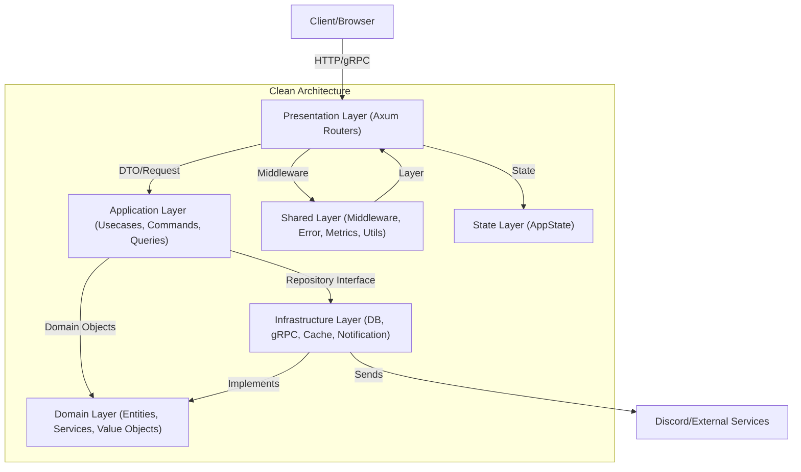

# Rusted-CA

## クイックスタートガイド

このテンプレートを使い始めるには、以下の手順を参考にしてください。

1. **リポジトリをクローン**
    ```sh
git clone https://github.com/kazuma0606/rusted-ca.git
cd rusted-ca/rusted-ca
```
2. **Rustツールチェーンのインストール**
    - [Rust公式サイト](https://www.rust-lang.org/tools/install) の手順で `rustup` を導入
    - 推奨: 最新の stable チャンネル
3. **依存クレートの取得**
    ```sh
cargo fetch
```
4. **.envファイルの作成**
    - プロジェクトルート（Cargo.tomlと同じディレクトリ）に `.env` を作成し、必要な環境変数を記載
    - Discord通知を使わない場合は `DISCORD_ENABLED=false` でOK
    ```
DISCORD_WEBHOOK_URL=（必要に応じて）
DISCORD_SERVER_NAME=rusted-ca-dev
DISCORD_ENABLED=true
DISCORD_TIMEOUT=5
```
5. **DB初期化（SQLite.inmemory）**
    - 初回起動時に自動生成されます。手動でDBファイルを用意する必要はありません。
6. **サーバー起動**
    ```sh
cargo run
```
    - デフォルトで `localhost:3000` でAPIが起動します。
7. **セキュリティヘッダーの有効化（任意）**
    - `src/presentation/router/app_router.rs` の `.layer(middleware::from_fn(security_headers_middleware))` のコメントを外すだけで主要なセキュリティヘッダーが有効になります。

---

## 主な機能
- クリーンアーキテクチャ + CQRS + DI + gRPC + Discord通知 + セキュリティヘッダー対応
- ドメイン層/アプリケーション層/インフラ層/プレゼンテーション層の分離
- CQRS（コマンド・クエリ分離）
- SQLite対応
- gRPC (Prost)
- DIコンテナ
- ログ・メトリクス収集
- **Discord通知（エラー時/拡張可）**
- **主要なセキュリティヘッダー自動付与（CSP, HSTS, X-Frame-Options, X-Content-Type-Options）**

---

## アーキテクチャ図（Mermaid形式）



---

## セキュリティヘッダー自動付与

- `shared/middleware/security_headers_middleware.rs` で主要なセキュリティヘッダー（CSP, HSTS, X-Frame-Options, X-Content-Type-Options）を自動付与するミドルウェアを提供
- `presentation/router/app_router.rs` で `.layer(middleware::from_fn(security_headers_middleware))` のコメントを外すだけで有効化／コメントアウトで無効化できる**簡単設計**
- 必要に応じてCSP等の値をカスタマイズ可能

---

## Discord通知機能

- アプリケーションのHTTPエラー発生時などに、Discordの指定チャンネルへ自動通知します。
- Webhook URLを設定するだけで、チーム全体でリアルタイムに障害や重要イベントを共有できます。
- 通知内容やタイミングは`shared/middleware/discord_middleware.rs`でカスタマイズ可能
- CI/CDやテスト結果の通知も簡単に追加可能（`idea/future_task.MD`参照）

---

## 開発・運用
- `.env`は必ず「KEY=VALUE」形式で記載してください
- 詳細な設計や拡張アイデアは`ARCHITECTURE.MD`や`idea/`ディレクトリを参照
- 何か困ったことや追加要望があれば、issueや[Discord](https://discord.gg/xmCNqRgF)でご相談ください！

---

## ライセンス

MIT License で誰でも自由に利用・改変・商用利用できます。

## Author

Yoshimura Hisanori
