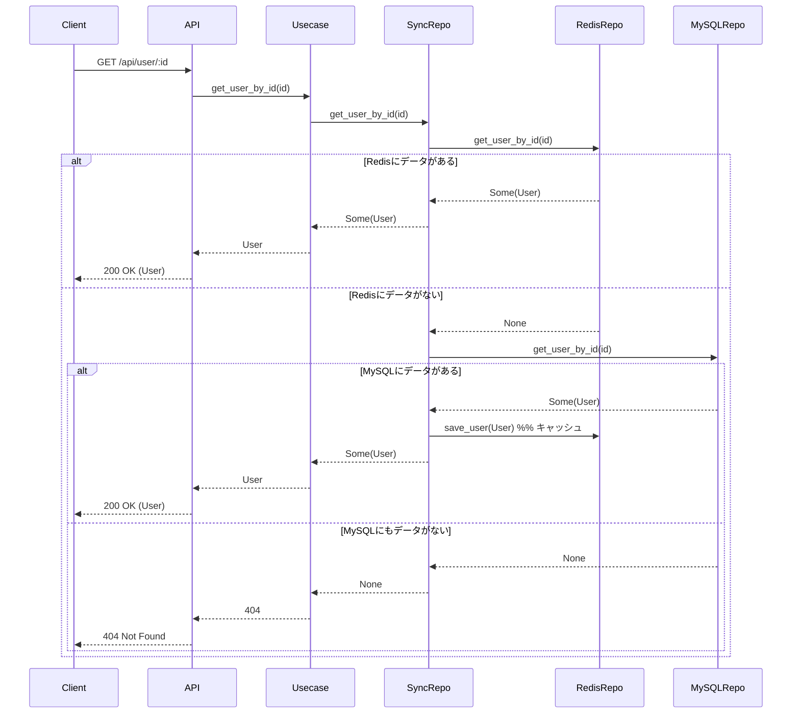

もちろんです！  
**現状の「ユーザー取得API（GET /api/user/:id）」のキャッシュ・アズ・サイド構成**について、  
どの層で何が定義され、どのように動くかを分かりやすく備忘録としてまとめます。

---

# ユーザー取得APIのキャッシュ・アズ・サイド構成 備忘録

---

## 1. **層ごとの役割と定義**

### ■ Repository層
- **SyncUserSqlxRepository**  
  - 「Redis（キャッシュ）→なければMySQL（マスタ）→Redisにキャッシュ」のアルゴリズムを実装
  - `get_user_by_id`メソッドでキャッシュ・アズ・サイドを実現
- **RedisUserSqlxRepository**  
  - RedisのHash構造からユーザー情報を取得・保存
- **TiDBUserSqlxRepository**  
  - MySQL(TiDB)からユーザー情報を取得・保存

### ■ Usecase層
- **CreateUserSqlxUsecase**  
  - Repositoryの`get_user_by_id`を呼び出し、DTOに変換して返す

### ■ Web/API層
- **api_router.rs**  
  - GET `/api/user/:id` エンドポイントでUsecaseを呼び出し、結果を返却

---

## 2. **アルゴリズム（キャッシュ・アズ・サイド）**

### 1. **GET /api/user/:id の流れ**

---

### 2. **POST（新規作成）の流れ**
- **必ずRedisとMySQL両方に書き込む**
- そのため、通常はGET時にRedisにデータが存在する

---

## 3. **ポイント・備考**

- **キャッシュ・アズ・サイド（Cache Aside）パターン**
  - まずキャッシュ（Redis）を参照し、なければDB（MySQL）を参照
  - DBヒット時はキャッシュにも保存
- **パフォーマンス最適化と一貫性のバランスが良い**
- **Redisのデータが消えた場合も自動でMySQLから復元される**
- **POST時は両方に書き込むので、通常はキャッシュヒットが多い**

---

## 4. **どこで何が定義されているか**

- **Repository層**  
  - キャッシュ戦略のアルゴリズム本体（SyncUserSqlxRepository）
- **Usecase層**  
  - Repositoryを呼び出すだけ（ビジネスロジックの集約点）
- **Web/API層**  
  - エンドポイント定義とレスポンス整形

---

## 5. **今後の拡張例**
- TTLや失効時の再取得
- キャッシュ更新戦略の追加
- source情報の返却やメトリクス連携

---

**この備忘録を見れば、現状のキャッシュ・アズ・サイド構成と各層の役割・流れが一目で分かります！**  
ご自身の設計・運用メモやチーム共有にもご活用ください。